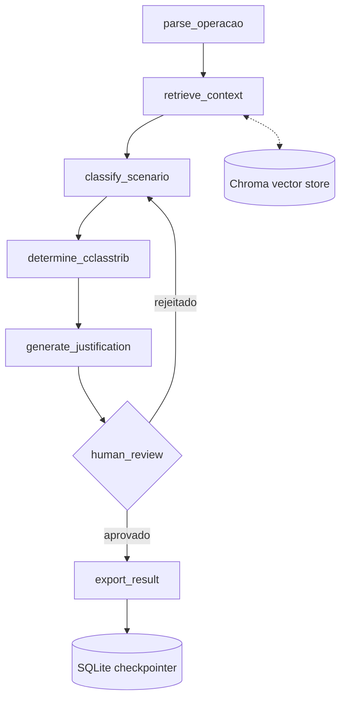

# Design: Agente de Classificação Tributária de Frete (RAG + LangGraph)

Referência: `.kiro/specs/agente-classificacao-tributaria-frete/requirements.md`

## 1. Visão geral da arquitetura



- Grafo implementado com `langgraph.graph.StateGraph`.
- `human_review` usa `interrupt()` do LangGraph — a execução para de verdade e só retoma quando o
  usuário responder (aprovar, rejeitar ou editar).
- `SqliteSaver` como checkpointer, permitindo retomar/auditar qualquer execução (requisito 7.2).

---

## 2. Modelo de estado (State)

```python
from typing import TypedDict, Literal, Optional
from pydantic import BaseModel

class Operacao(BaseModel):
    modal: Literal["rodoviario", "aereo", "aquaviario"]
    origem_uf: str
    destino_uf: str
    regime_tributario: Literal["simples_nacional", "lucro_presumido", "lucro_real"]
    data_emissao: str  # ISO 8601
    contratado_pessoa_fisica: bool = False  # TAC

class TrechoRecuperado(BaseModel):
    documento: str       # ex: "LC 214/2025 - Art. 12"
    trecho: str
    score: float

class Classificacao(BaseModel):
    fase_transicao: Literal["2026_teste", "2027_2032_convivencia", "2033_definitivo", "regime_especial"]
    obrigatoriedade_destaque: bool
    observacoes: Optional[str] = None

class ResultadoCClassTrib(BaseModel):
    cclasstrib: Optional[str]
    aliquota_estimada: Optional[float]
    determinado: bool  # False = "não determinado, requer revisão manual"

class AgentState(TypedDict):
    operacao: Operacao
    contexto_recuperado: list[TrechoRecuperado]
    classificacao: Optional[Classificacao]
    resultado_cclasstrib: Optional[ResultadoCClassTrib]
    justificativa: Optional[str]
    fontes_citadas: list[str]
    aprovado_por_humano: Optional[bool]
    resultado_exportado: Optional[dict]
```

---

## 3. Nós do grafo (contrato de cada função)

| Nó | Entrada (do State) | Saída (atualiza no State) | Requisito relacionado |
|---|---|---|---|
| `parse_operacao` | input bruto do usuário | `operacao: Operacao` (validado) | R1 |
| `retrieve_context` | `operacao` | `contexto_recuperado: list[TrechoRecuperado]` | R2 |
| `classify_scenario` | `operacao`, `contexto_recuperado` | `classificacao: Classificacao` | R3 |
| `determine_cclasstrib` | `classificacao` | `resultado_cclasstrib: ResultadoCClassTrib` | R4 |
| `generate_justification` | `classificacao`, `resultado_cclasstrib`, `contexto_recuperado` | `justificativa`, `fontes_citadas` | R5 |
| `human_review` | tudo acima | `aprovado_por_humano: bool` (via `interrupt()`) | R6 |
| `export_result` | tudo acima, se aprovado | `resultado_exportado: dict` (grava JSON) | R7 |

Cada nó é uma função pura `def nome_do_no(state: AgentState) -> dict` que retorna apenas as
chaves que atualiza (padrão de reducer do LangGraph).

---

## 4. Regra de negócio determinística (`determine_cclasstrib`)

Implementada como **tabela/lookup em código Python** (dicionário ou `pandas.DataFrame`), nunca
como texto gerado pelo LLM — conforme restrição em `.kiro/steering/tech.md`. Estrutura sugerida:

```python
TABELA_CCLASSTRIB: dict[tuple[str, str, bool], ResultadoCClassTrib] = {
    ("2026_teste", "lucro_real", False): ResultadoCClassTrib(
        cclasstrib="000001", aliquota_estimada=0.01, determinado=True
    ),
    # ... demais combinações mapeadas a partir da LC 214/2025 e Notas Técnicas
}
```

Se a combinação não existir na tabela, retorna `determinado=False` e o fluxo aponta para revisão
manual (requisito 4.2).

---

## 5. RAG — pipeline de ingestão

1. Documentos-fonte em `/data/docs_regulatorios/` (texto plano ou PDF convertido).
2. Chunking: 500–800 tokens, overlap de 100 (biblioteca `langchain_text_splitters`).
3. Embeddings: `OllamaEmbeddings(model="nomic-embed-text")`.
4. Armazenamento: `Chroma(persist_directory="./data/chroma_db")`.
5. Retrieval: top-k (k=4) por similaridade, com score mínimo configurável (requisito 2.2).

---

## 6. Tratamento de erros

- Falha na geração estruturada do LLM (`generate_justification`) → uma nova tentativa
  automática; se falhar de novo, o nó retorna erro explícito no `State` em vez de dado inventado
  (requisito 5.3).
- Contexto insuficiente no RAG → `classify_scenario` recebe uma flag `contexto_insuficiente=True`
  e o resultado final indica isso ao usuário em vez de seguir adiante sem base (requisito 2.2).

---

## 7. Rastreabilidade Requisitos → Design

| Requisito | Onde é atendido no design |
|---|---|
| R1 | `parse_operacao` + validação Pydantic |
| R2 | Pipeline RAG (seção 5) + nó `retrieve_context` |
| R3 | `classify_scenario` + enum `fase_transicao` |
| R4 | `TABELA_CCLASSTRIB` determinística |
| R5 | `generate_justification` com `fontes_citadas` obrigatório |
| R6 | `interrupt()` no nó `human_review` |
| R7 | `export_result` + `SqliteSaver` |
| R8 | `/data/golden_set` + `pytest` (ver `tasks.md`, ISSUE-013) |
